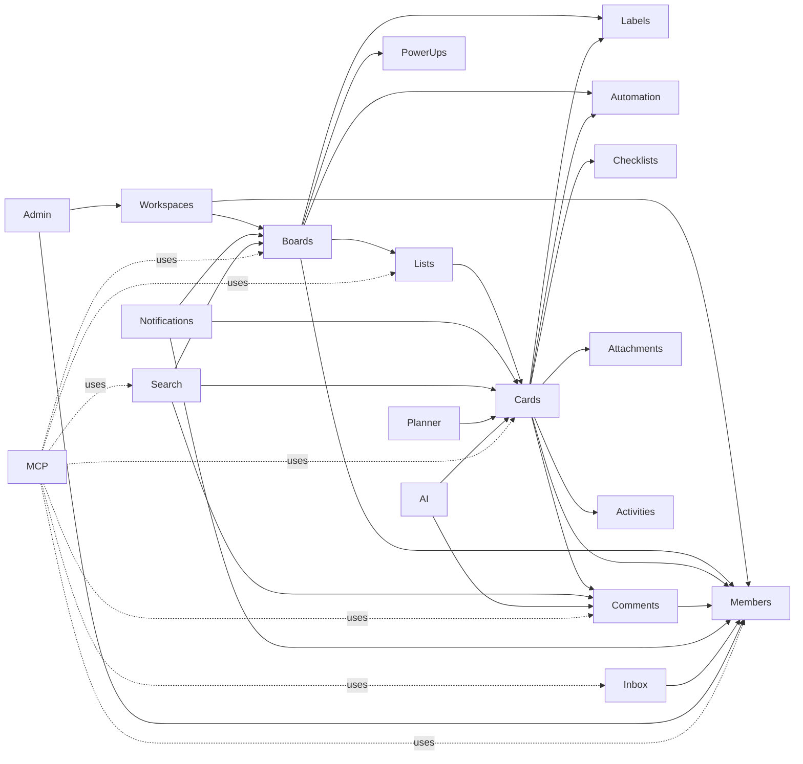

# Bounded contexts

> A catalog of every bounded context in Cardscape, what it owns,
> and which other contexts it talks to. This is the **map** of
> the vertical slices.

## 1. What is a bounded context?

In Domain-Driven Design terms, a bounded context is a boundary
inside which a particular model is consistent. Two contexts
representing the same real-world concept (say, a "user") may
have different shapes, different rules, and different
attributes.

In Cardscape, each context is:

- A folder under `src/Cardscape.Domain/` (entity + VOs + events)
  and under `src/Cardscape.Application/` (commands + queries +
  DTOs + validators).
- Optionally a folder under
  `src/Cardscape.Infrastructure/Persistence/Repositories/`
  (when the context has its own repository) and
  `src/Cardscape.Infrastructure/Persistence/Configurations/`
  (EF Core mappings).
- Optionally a folder under `src/Cardscape.Api/Endpoints/`
  (when it has its own HTTP surface).
- Optionally a folder under `src/Cardscape.Mcp/Tools/`
  (when it has its own MCP tool surface).
- Optionally a folder under `src/Cardscape.Web/Components/`
  (when it has its own UI surface).

Two contexts communicate only through **domain events** (one
raises, the other handles) or through **application-layer
queries** (one reads a read-model of the other). They never
reference each other's entities directly.

## 2. The catalog

| Context | Status | Owns | Talks to | Phase |
|---|---|---|---|---|
| **Workspaces** | not started | workspace, workspace member, workspace invite | Members, Boards | 1 |
| **Members** | not started | user, profile, password, last login, sessions, **API token** | (none) | 1 |
| **Boards** | not started | board, board star, board background | Workspaces, Members, Lists, Labels, Cards, Power-Ups | 1 |
| **Lists** | not started | list, list position | Boards, Cards | 1 |
| **Cards** | not started | card, card position, archived state | Boards, Lists, Members, Labels, Checklists, Comments, Attachments, Activities | 1 |
| **Labels** | not started | label | Boards, Cards | 1 |
| **Checklists** | not started | checklist, checklist item | Cards | 1 |
| **Comments** | not started | comment, comment reaction, mention | Cards, Members | 1 |
| **Attachments** | not started | attachment (file or link), preview | Cards, Storage | 1 |
| **Activities** | not started | activity event (append-only) | Cards, Boards | 1 |
| **Notifications** | not started | in-app notification, email subscription | Members, Cards, Boards, Lists | 1 |
| **Search** | not started | full-text index of boards / cards / comments | Cards, Boards, Comments, Members | 1 |
| **MCP** | not started | (thin) tool / resource / prompt dispatch | every context that exposes a tool | 2 |
| **Inbox** | not started | inbox item | Members, Cards | 2 |
| **Planner** | not started | scheduled reminder, calendar event | Members, Cards | 2 |
| **Extensions** | not started | extension definition, board extension, per-board config | Boards | 3 |
| **Automation** | not started | rule, custom button, scheduled command, run log | Cards, Boards, Lists, Members | 3 |
| **Integrations** | not started | webhook, OAuth app, third-party mapping | Boards, Members | 3 |
| **AI** | not started | AI request log, AI suggestion | Cards, Comments, Boards | 4 |
| **Admin** | not started | org-wide settings, SSO, audit log | Members, Workspaces, Boards | 4 |

## 3. Context map

Visualization of how contexts collaborate (Mermaid):

Solid arrows represent **allowed references** (one context may
read another's read model or handle its domain events). The
dashed arrows from `MCP` represent that `MCP` is a thin
**transport layer** that doesn't have its own data — it just
exposes tools that delegate to the underlying contexts.

## 4. Adding a new bounded context

1. Create `src/Cardscape.Domain/<Context>/` with the entity,
   VOs, events.
2. Create `src/Cardscape.Application/<Context>/` with the
   commands, queries, DTOs, validators, and event handlers.
3. Create
   `src/Cardscape.Infrastructure/Persistence/Configurations/<Entity>Configuration.cs`.
4. Create
   `src/Cardscape.Infrastructure/Persistence/Repositories/<Context>Repository.cs`
   if the context has its own repository.
5. Add the SQLite migration to the canonical EF Core history.
6. **For the REST surface**: add `src/Cardscape.Api/Endpoints/<Context>/`
   with the endpoints.
7. **For the AI surface**: add `src/Cardscape.Mcp/Tools/<Context>Tool.cs`
   with the tools. Each tool is a one-liner that delegates to
   the underlying handler.
8. Add `src/Cardscape.Web/Components/<Context>/` with the
   components.
9. Update [`00-overview.md`](00-overview.md) to add the
   context to the table and the Mermaid diagram.
10. Add unit + integration tests.

## 5. Cross-context reads

When context A needs to display data from context B, it
queries through an application-layer read model. Example:

`Cardscape.Application/Cards/Queries/GetCardById.cs` returns a
`CardDetailsDto` that includes the assignee's display name
(loaded via `IUserDirectory.GetDisplayNameAsync`). The DTO is
shaped at the application layer; the card entity doesn't
know about user display names.

## 6. Domain events between contexts

When context A raises a domain event, context B may handle it.
Example: `Boards` raises `BoardArchived`. `Cards` handles it
by archiving all cards on the board. `Activities` handles it
by writing an entry to the board's activity log.

Domain events are dispatched in-process by Wolverine after
`SaveChangesAsync` succeeds. In Phase 5 we may add an external
event bus (RabbitMQ / Service Bus) for cross-process
communication, but the API stays the same: handlers are
`INotificationHandler<TEvent>`.

## 7. The `MCP` context

`MCP` is **not a regular bounded context** — it has no data
of its own. It's a thin transport layer that:

- Lives in a separate project (`src/Cardscape.Mcp/`).
- Depends on `Application` and `Domain`, **not** on
  `Infrastructure` or `Api`.
- Exposes tools, resources, and prompts that delegate to
  underlying context handlers.
- Is deployed as a separate process with an authenticated stateful
  Streamable HTTP endpoint at `/mcp`.
- Is authenticated by API tokens (a new entity in the
  `Members` context).

The `MCP` row in the catalog above is a **placeholder for
documentation**: it doesn't have a Domain folder or an
Application folder. It just has `Tools/`, `Resources/`, and
`Prompts/` classes that each delegate to a real bounded
context's command or query.

## 8. References

- [`00-overview.md`](00-overview.md) — the dependency
  direction and the directory layout.
- [`03-mcp-server.md`](03-mcp-server.md) — the MCP server
  operational guide.
- [`../adr/0002-mcp-server.md`](../adr/0002-mcp-server.md) —
  the MCP decision.
- [`../development/02-vertical-slices.md`](../development/02-vertical-slices.md)
  — the recipe for adding a feature end-to-end.
- [Microsoft — Domain-Driven Design](https://learn.microsoft.com/dotnet/architecture/microservices/microservice-ddd-cqrs-patterns/)
